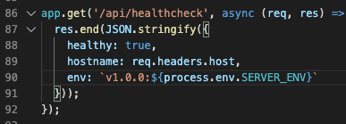
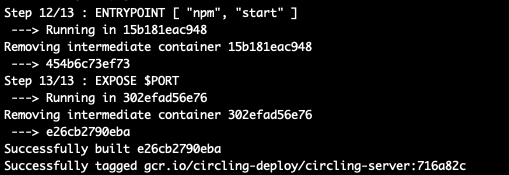
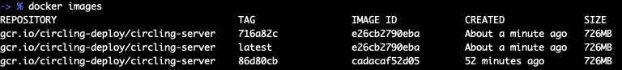
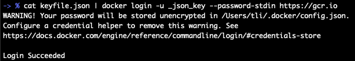
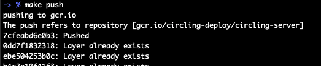
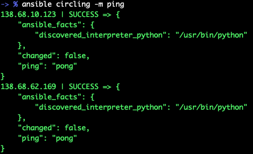
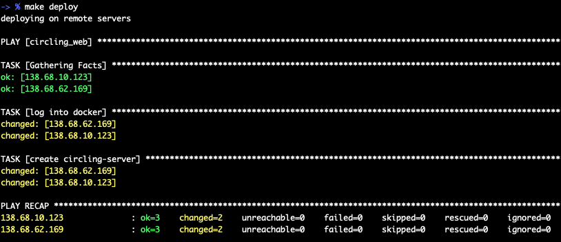
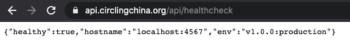

# Circling China Site

This project compiles to a statically generated website for https://circlingchina.org.


## How the site is built

The starting point of the site is a static export of a webflow project.
[Eleventy](https://www.11ty.dev/) is used to preprocess the html.
A couple of areas with complicated logic is rendered as a react component, and built with [Parcel](https://parceljs.org/).

The entire site is built to the `_site` folder, which can be easily hosted on a static host such as netlify.

There's no backend. Server side functionality are built via a collection of 3rd party services:
- Authentication: [netlify auth](https://docs.netlify.com/visitor-access/identity/)
- Blogposts: netlifycms.org
- Event and User tables: airtable.com

## Setup

**Development**

`npm run dev`

For localhost development, setup a [.env](.env) file:

`cp .env.sample .env`

(this file is designed to hold sensitive data, and should not be checked into source control)

**Build**

`npm run build`

**Staging Branch**

The `staging` branch is configured to auto-deploy to https://staging.circlingchina.org/ and can be used to test and demo experimental features
  

## API Server

There is a standalone nodejs server for emails, payments, and scheduling jobs. To deploy the server:

```
cd server
npm install
npm start
```

The server also has its own environment file, which can hold secrets not avaliable to the client(i.e aws SES credentials)

```
cd server
cp .env.sample .env
```

The server and client can both utilize modules in the /lib folder. So in theory, we should keep code in the lib folder isomorphic(able to run on both brower and node environment).

# Building and Deploying circling-server

## Prerequisits for deploying to production:

- install docker: https://docs.docker.com/get-docker/
- install ansible: https://docs.ansible.com/ansible/latest/installation_guide/intro_installation.html
- add hosts to ansible (see detail below)
- ssh access to production servers (i.e put your id_rsa.pub in authorized_keys file)
- access to circling private repository (acquire a keyfile.json)

## Making Changes

The currently deployment flow is git commit-based (in anticipation of setting up CI/CD later)

For example, let's make a trivia change in [server/index.js]:



Commit the change, so there is a new commit hash in the current branch.

```sh
git add server/index.js
git commit -m "incrementing the server version"
```

## Building Images Locally

In the root directory of the project:

```sh
make build
```



Verify the images are built with:

```sh
docker images
```



## Pushing Builds to Container Repository

To push builds to gcr(google container repository), you must first login:

```
mkdir ~/.gcr
mv keyfile.json ~/.gcr/
cat ~/.gcr/keyfile.json | docker login -u _json_key --password-stdin https://gcr.io
```



You only have to login once. For more info see: https://cloud.google.com/container-registry/docs/advanced-authentication#json-key

Once logged in, you can push builds with:

```sh
make push
```



## Deploying Builds

To deploy builds, you need to add machines to ansible hosts(/etc/ansible/hosts on linux):

```sh
[circling]
138.68.10.123 ansible_user=deployer
138.68.62.169 ansible_user=deployer
```

If you can't find or need to customize location of the hosts file, see: https://stackoverflow.com/a/21959961

Test your setup by pinging the remote machines:

```sh
ansible circling_web -m ping
```



If the ping works, everything should be properly configured. Deploy via:

```sh
make deploy
```

Ansible should deploy the correct image



The change should be live in [the production server](https://api.circlingchina.org/api/healthcheck):

